# Penetration Testing: Password Cracking & Hash Extraction (Week 3)

## 📌 Project Overview
This repository contains the comprehensive documentation for the Week 3 practical labs of the Networkwalks Cybersecurity Program. The objective was to demonstrate the vulnerabilities of weak passwords by extracting cryptographic hashes from locked PDF documents and recovering the plaintext passwords using dictionary attacks.

To thoroughly explore password cracking methodologies, this project was completed using two distinct approaches: local command-line/GUI tools and web-based utilities.

## 🚀 Modules Completed
*   **W3-PM1 (Password Cracking with JTR):** Utilizing the industry-standard John the Ripper (JTR) via the Johnny graphical interface installed natively on Kali Linux.
*   **W3-PM2 (Password Cracking with NW Tools):** Utilizing the Networkwalks Hash Calculator and web-based dictionary attack environment.

---

## 🛠️ Step-by-Step Execution: W3-PM1 (Local Cracking with John the Ripper)

### Step 1.1: Extracting the Hash
The locked PDF was first submitted to OnlineHashCrack to extract the cryptographic hash from the file.

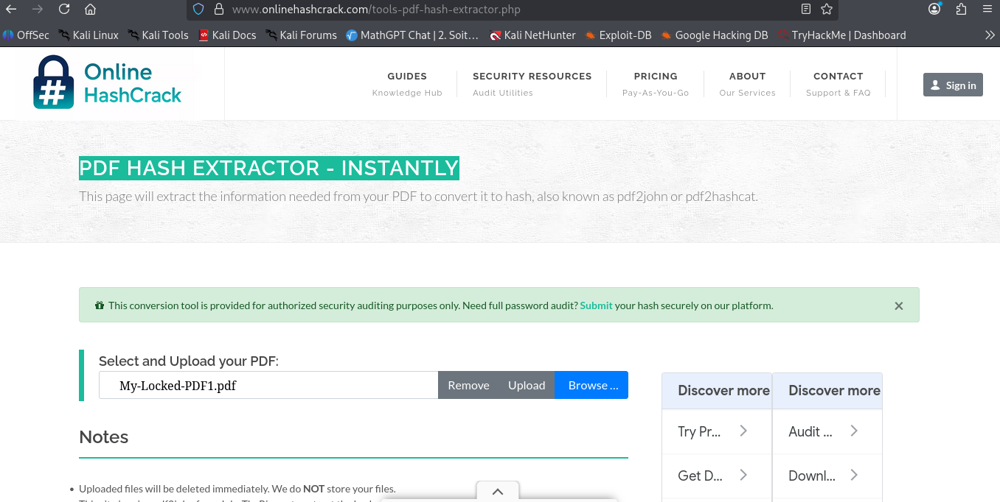

The tool successfully parsed the document and generated a fingerprint compatible with the `$pdf$` format.

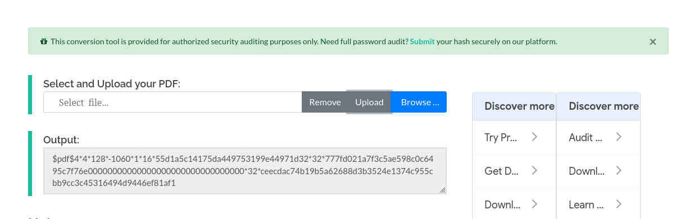

### Step 1.2: Preparing the Hash File in Kali Linux
Using the Kali Linux terminal, a new text file named `hash1.txt` was created to store the extracted hash.

The hash was pasted and saved securely using the `nano` text editor.

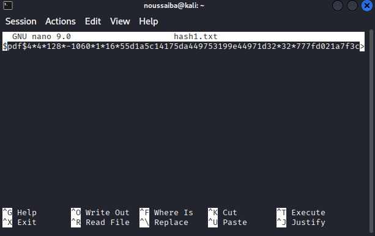

### Step 1.3: Installing Johnny GUI
To streamline the cracking process, the graphical interface for John the Ripper (Johnny) was installed natively on Kali Linux using the APT package manager.

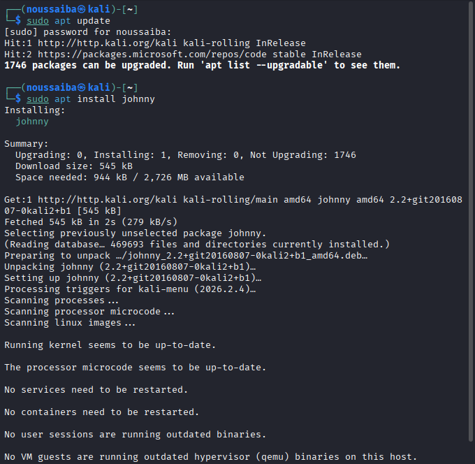

### Step 1.4: Configuring Johnny & Cracking the Password
Johnny was launched and configured to target the native John the Ripper executable located at `/usr/sbin/john`. 

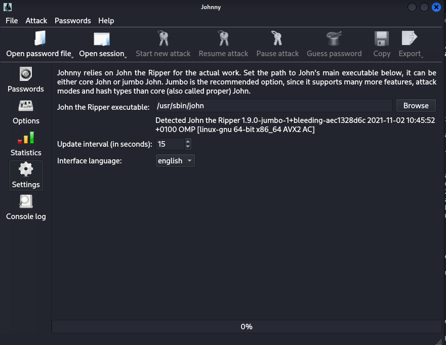

The `hash1.txt` file was imported into the tool.

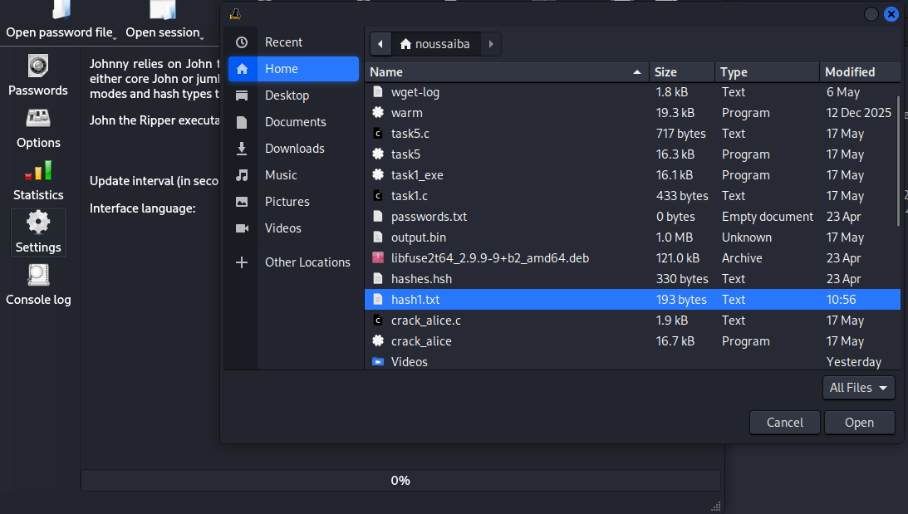

A dictionary attack was initiated. The tool rapidly tested a wordlist against the hash and successfully revealed the plaintext password: `password1`.

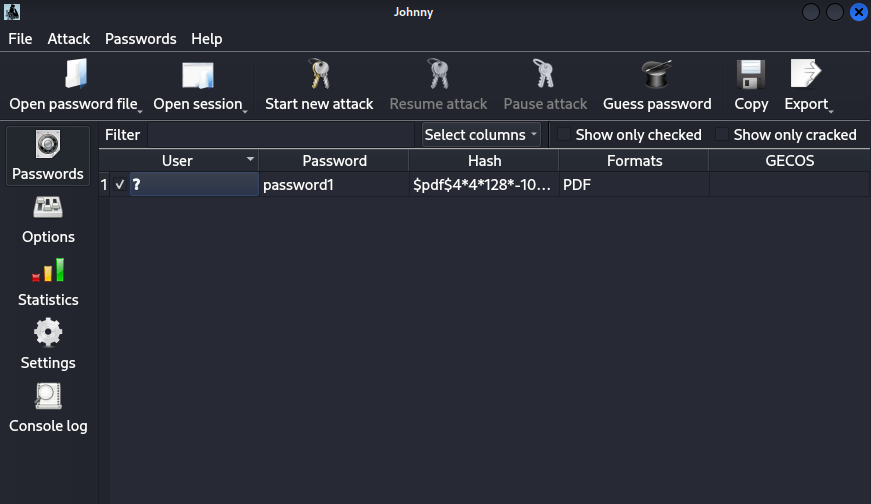

---

## 🛠️ Step-by-Step Execution: W3-PM2 (Web-Based Cracking with NW Tools)

### Step 2.1: Acquiring the Target
The target file, `My-Locked-PDF1.pdf`, was downloaded directly to the local machine.

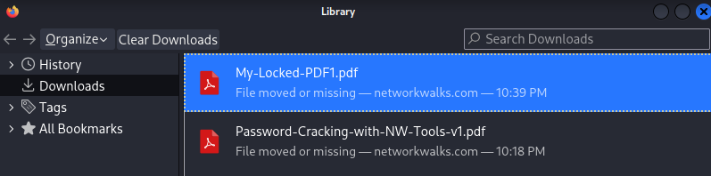

### Step 2.2: Extracting Hash via NW Tools
The locked PDF was imported into the Networkwalks Hash Calculator.

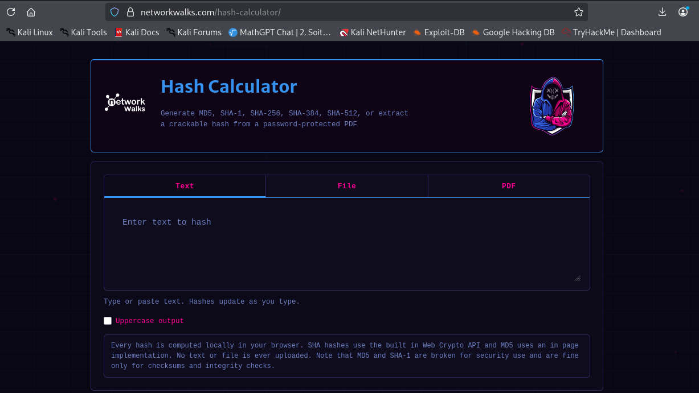

The tool parsed the document locally without uploading the file, successfully extracting the `$pdf$` hash.

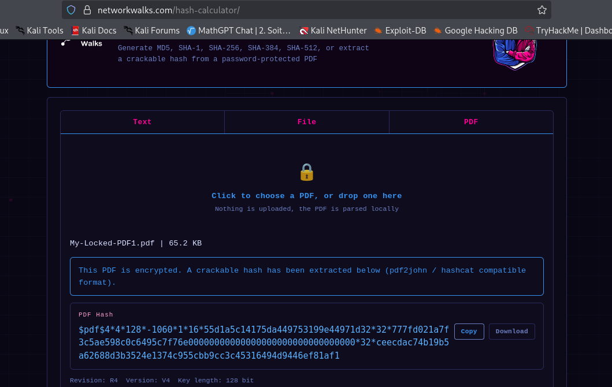

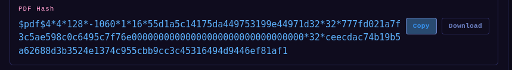

### Step 2.3: Executing the Web Dictionary Attack
The extracted hash was taken to the Dictionary Attack Lab, which simulates brute-force and dictionary password crackers.

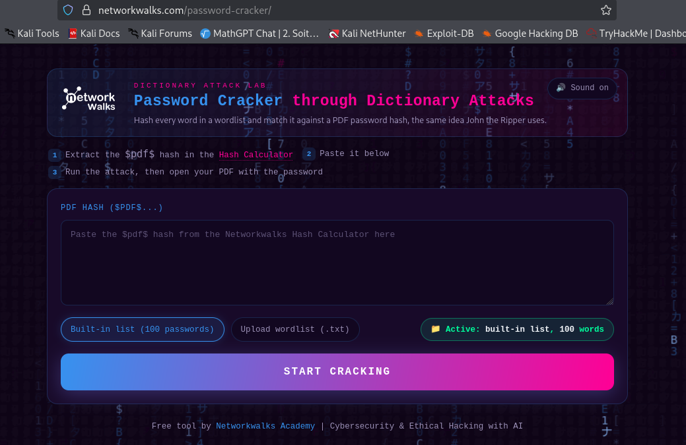

The hash was pasted into the tool and executed against a built-in wordlist of 100 common passwords.

The simulated dictionary attack successfully matched the hash, revealing the plaintext password: `password1`.

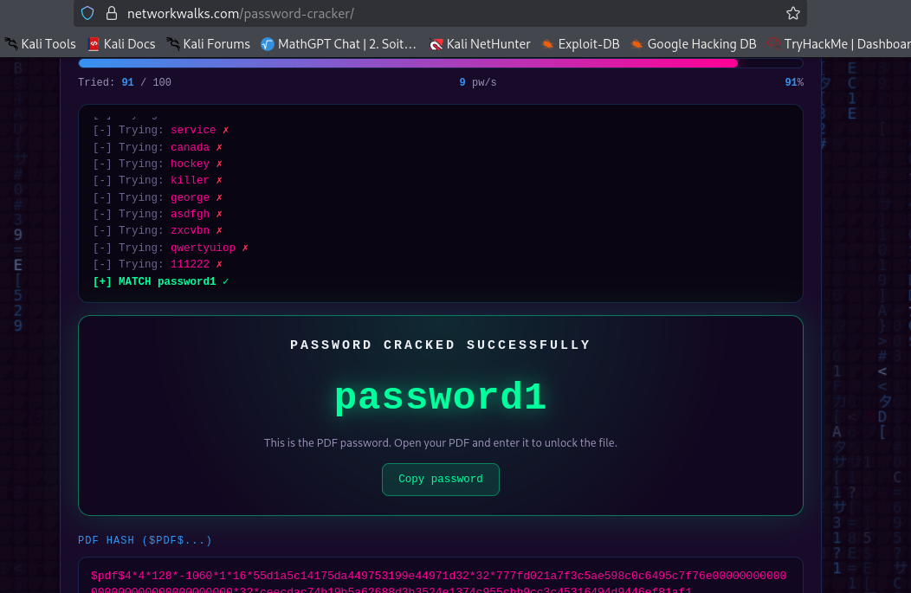

---

## 🏁 Final Phase: Document Unlock & Flag Capture

Using the recovered weak password (`password1`), the PDF document's encryption was successfully bypassed.

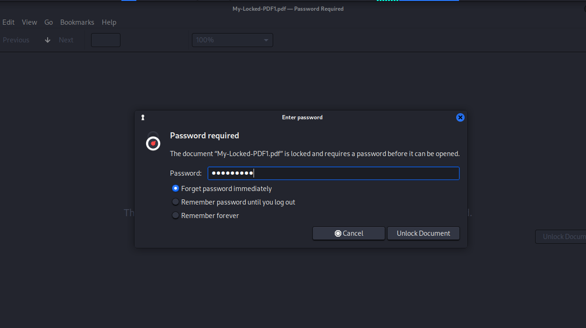

Opening the document revealed the congratulatory message and the hidden flag validating the exercise.

**Captured Flag:** `nw{networkwalks_flag1_jtr_270521_1}`

---

## 📊 Conclusion
This exercise practically demonstrates the critical vulnerability of dictionary-based passwords. As a Master's student in Cryptography and Information Security, this lab serves as a concrete illustration that even the most robust mathematical encryption standards are instantly rendered useless if the underlying password (the human factor) lacks entropy and complexity.

## ⚠️ Legal Disclaimer
All activities documented in this project were performed strictly for educational purposes within an authorized and simulated lab environment provided by Networkwalks.
